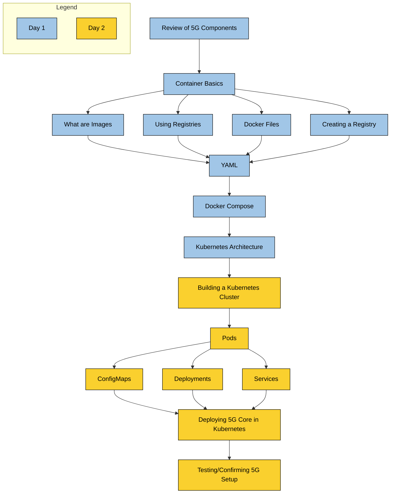

```mermaid
flowchart TD
    style A fill:#A1C6E7,stroke:#000000,color:#000000
    style B fill:#A1C6E7,stroke:#000000,color:#000000
    style C fill:#A1C6E7,stroke:#000000,color:#000000
    style D fill:#A1C6E7,stroke:#000000,color:#000000
    style E fill:#A1C6E7,stroke:#000000,color:#000000
    style F fill:#A1C6E7,stroke:#000000,color:#000000
    style G fill:#A1C6E7,stroke:#000000,color:#000000
    style H fill:#A1C6E7,stroke:#000000,color:#000000
    style I fill:#A1C6E7,stroke:#000000,color:#000000
    style J fill:#FAD02E,stroke:#000000,color:#000000
    style K fill:#FAD02E,stroke:#000000,color:#000000
    style L fill:#FAD02E,stroke:#000000,color:#000000
    style M fill:#FAD02E,stroke:#000000,color:#000000
    style N fill:#FAD02E,stroke:#000000,color:#000000
    style O fill:#FAD02E,stroke:#000000,color:#000000
    style P fill:#FAD02E,stroke:#000000,color:#000000


    subgraph Legend
        direction TB
        L1[Day 1]
        L2[Day 2]
        style L1 fill:#A1C6E7,stroke:#000000,color:#000000
        style L2 fill:#FAD02E,stroke:#000000,color:#000000
    end

    A[Review of 5G Components] --> B[Container Basics]
    B --> C[What are Images]
    B --> D[Using Registries]
    B --> E[Docker Files]
    B --> F[Creating a Registry]
    C --> G[YAML]
    D --> G[YAML]
    E --> G[YAML]
    F --> G[YAML]
    G --> H[Docker Compose]
    H --> I[Kubernetes Architecture]
    I --> J[Building a Kubernetes Cluster]
    J --> K[Pods]
    K --> L[ConfigMaps]
    K --> M[Deployments]
    K --> N[Services]
    L --> O[Deploying 5G Core in Kubernetes]
    M --> O[Deploying 5G Core in Kubernetes]
    N --> O[Deploying 5G Core in Kubernetes]
    O --> P[Testing/Confirming 5G Setup]
```
